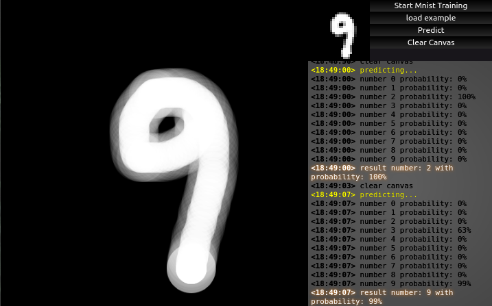

# tfjs-number-guess
 tfjs interactive number guessing. you can draw and let it guess.

 ## depencies
 - tfjs
 - p5js
 - [cazala's mnist library](https://github.com/cazala/mnist)
 
 ## links
 - [video(youtube)](https://youtu.be/kw6w2QdhvfU)

 ## screenshots

## notes
I was expecting this to work much better with higher accuracy. due to my knowledge in ml field and the style of mnist data set, results are very bad. mnist data set contains handwritten numbers with different stroke size based on the pen's pressure. in this project, you can just draw with your mouse. so the ml doesnt really trained with what you are going to give it to.

the number 4 in mnist data set is written like 7segment display 4s. it took me longer than expected to realize this.

refreshing the page while the page zoom is not default may break the canvas. zoom after refreshing the page if necessary.

css in this project is worse than usual. 
